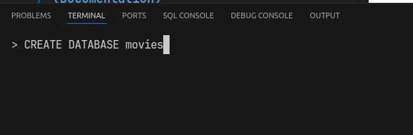
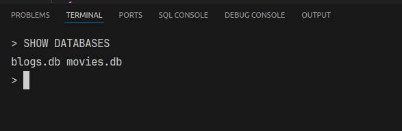
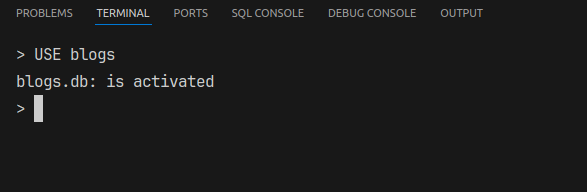
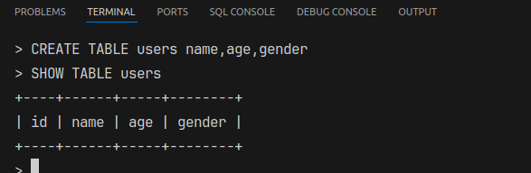
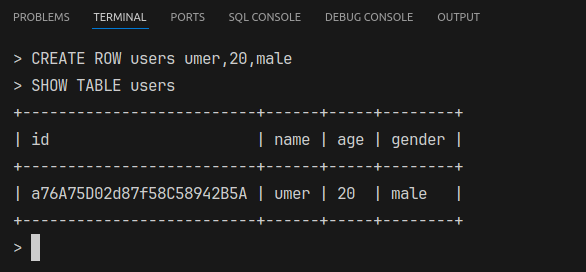
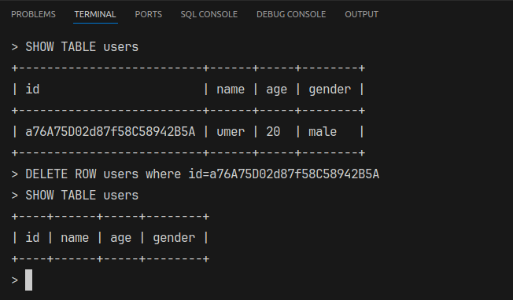
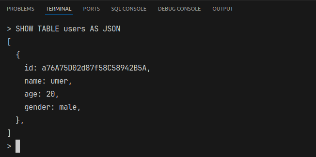
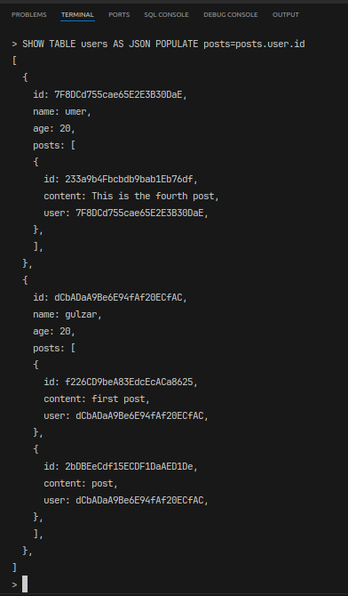
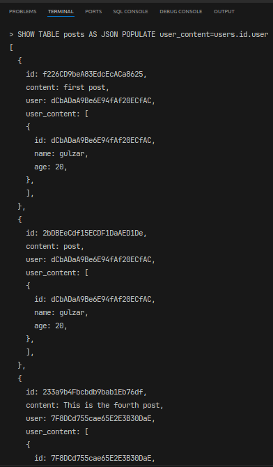

# Database Management System (Documentation)

## Collaborators

| ID          | Name    |
| ----------- | ------- |
| F2023266912 | M. Umer |

## Introduction

Created Database Management System without any libraries. It can handle following operations.

- Creating Multiple Databases
- Create Multiple Tables in single Database
- Create Multiple Rows in a single Table
- Show the tables as TABLE or JSON
- Relations can be added between multiple tables, like:
  - One to One
  - One to Many
  - Many to Many

## Run the App

`$ ./run.sh`

## Create Database

`> CREATE DATABASE movies`

## Show All Databases

`> SHOW DATABASES`

## Select the current Database

`> USE blogs`

## Creating and Showing empty Table

`> CREATE TABLE users name,age,gender`

`> SHOW TABLE users`

## Adding row in the table

`> CREATE ROW users umer,20,male`

`> SHOW TABLE users`

## Delete row in the table

`> DELETE ROW users WHERE id=<id>`

`> SHOW TABLE users`

## Showing table as JSON

`> SHOW TABLE users AS JSON`

## Managing Relations

- ### One to Many

  - To create one to many relation.
  - Reference the parent in every child.
  - Like in every Blog Post add a `user_id` field that is the ID of user.
  - While populating you have to tell which table has `parent_ids` and and what `field` it is.

  - `> SHOW TABLE users AS JSON POPULATE <field_in_parent>=<table_name>.<referencing_parent_in_child>.<parents_referenced_field_in_child>`

## Child Referencing

`> SHOW TABLE users AS JSON POPULATE posts=posts.user.id`

## Parent Referencing

`> SHOW TABLE posts AS JSON POPULATE user_content=users.id.user`

